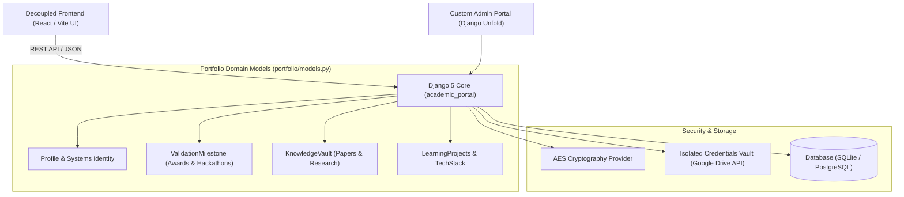

# Portfolio Backend: Django Academic & Systems Ledger Engine

[](LICENSE)
[](https://www.djangoproject.com/)
[](https://docs.djangoproject.com/en/5.2/ref/databases/)
[](https://huggingface.co/abdullahashraf122)
[](https://github.com/unfoldadmin/django-unfold)

**Portfolio Backend (academic_portal)** is a high-security Django web service and data ledger powering the **Abdullah Ashraf Systems Portfolio**.

It provides data persistence, cryptographic credential validation, technical milestone registries, and API endpoints for decoupled frontend clients (such as [`portfolio-frontend`](https://github.com/abdullah00ashraf/portfolio-frontend)).

---

## 1. Architecture & Core Subsystems



---

## 2. Directory Structure

```
PROTOFOLIO/
├── academic_portal/           # Django project root & settings
│   ├── asgi.py
│   ├── settings.py            # Environment-driven settings & security configs
│   ├── urls.py                # Main URL router
│   └── wsgi.py
├── portfolio/                 # Primary portfolio application
│   ├── admin.py               # Tailored Django Unfold admin interfaces
│   ├── apps.py
│   ├── models.py              # Profile, ValidationMilestone, KnowledgeVault
│   └── views.py               # REST API endpoints & data serializations
├── credentials/               # Isolated credentials directory (.gitignore protected)
│   └── google_drive_key.json.example
├── seed_credentials.py        # Database seeding for awards and certifications
├── seed_developer.py          # Database seeding for full developer profile
├── seed_identity.py           # Database seeding for systems manifesto
├── seed_knowledge_vault.py    # Database seeding for research papers
├── requirements.txt           # Production dependencies
├── manage.py                  # Django management CLI
├── .env.example               # Environment template
└── README.md                  # Backend documentation
```

---

## 3. Quickstart & Installation

### Prerequisites
- Python >= 3.11
- Git

### Installation

1. **Clone the repository:**
   ```bash
   git clone https://github.com/abdullah00ashraf/portfolio-backend.git
   cd portfolio-backend
   ```

2. **Create a virtual environment:**
   ```bash
   python -m venv .venv
   # Windows:
   .venv\Scripts\activate
   # Linux/macOS:
   source .venv/bin/activate
   ```

3. **Install dependencies:**
   ```bash
   pip install -r requirements.txt
   ```

4. **Environment Configuration:**
   ```bash
   cp .env.example .env
   # Customize .env with your local settings and SECRET_KEY
   ```

5. **Apply Database Migrations:**
   ```bash
   python manage.py migrate
   ```

6. **Seed Initial Database Ledger:**
   ```bash
   python seed_identity.py
   python seed_credentials.py
   python seed_developer.py
   python seed_knowledge_vault.py
   ```

7. **Create Superuser & Run Development Server:**
   ```bash
   python manage.py createsuperuser
   python manage.py runserver 8000
   ```
Access the custom Unfold admin dashboard at [http://localhost:8000/admin/](http://localhost:8000/admin/).

---

## 4. Configuration Reference

| Variable | Description |
| :--- | :--- |
| `SECRET_KEY` | Unique cryptographic salt used for Django session and token signing |
| `DEBUG` | Enable/disable detailed debug traces (`True` in development, `False` in production) |
| `ALLOWED_HOSTS` | Comma-delimited list of permitted domain names |
| `CRYPTOGRAPHY_KEY` | AES encryption key for securing private metadata fields |
| `GOOGLE_DRIVE_API_KEY` | API key for interacting with Google Drive credential attachments |

---

## 5. 🤗 Hugging Face Hub Neural Models & Datasets Integration

The backend ledger tracks, verifies, and catalogs production deep learning models and datasets published under [`abdullahashraf122`](https://huggingface.co/abdullahashraf122):

* **[Sentinel-Mumbai PINN v1](https://huggingface.co/abdullahashraf122/sentinel-mumbai-pinn-v1)**: 20.38M parameter Physics-Informed Neural Network.
* **[Sentinel-V7 Deep Flood LSTM](https://huggingface.co/abdullahashraf122/sentinel-v7-deep-flood-lstm)**: Dual Bi-LSTM flood forecasting model.
* **[Aegis ManagerAI Agentic SFT Mixture](https://huggingface.co/datasets/abdullahashraf122/aegis-managerai-agentic-sft-mixture)**: Augmented ChatML dataset with internal `<think>` reasoning traces and JSON tool calls.
* **[Alaska Arctic Hydrology Matrix](https://huggingface.co/datasets/abdullahashraf122/alaska-arctic-hydrology-matrix)**: 50,000-point spatiotemporal Parquet matrix.
* **[Mumbai Flood Intelligence (2005–2023)](https://huggingface.co/datasets/abdullahashraf122/mumbai-salsette-flood-intelligence-2005-2023)**: 27.84 GB Parquet dataset (633M records).

---

## 6. License

This project is licensed under the [MIT License](LICENSE) - see the LICENSE file for details.
